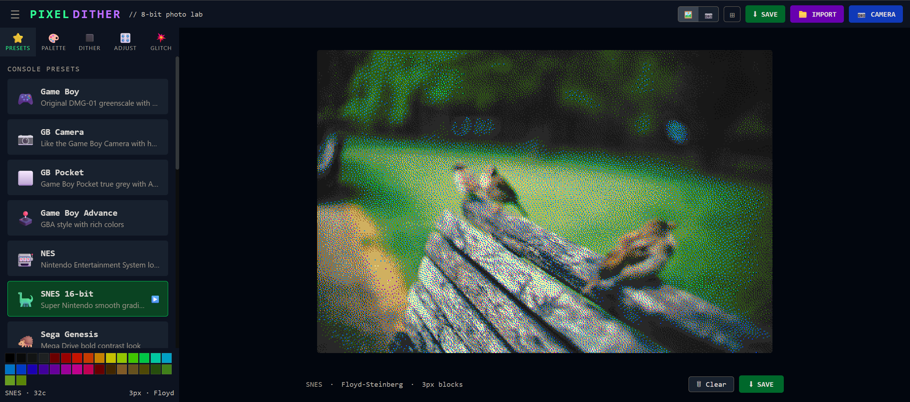

# PixelDither



A small React + Vite app for image dithering, palette selection, and glitch-style effects.

## Features

- Upload images or capture from camera
- Multiple dithering algorithms:
  - None (quantize)
  - Floyd–Steinberg
  - Atkinson
  - Jarvis–Judice–Ninke
  - Stucki
  - Sierra / Sierra Lite
  - Bayer ordered dithering
  - Checkerboard, pattern, blue noise, and random noise
- Select from built-in color palettes or define a custom palette
- Adjust image processing settings:
  - brightness, contrast, saturation
  - local contrast
  - dither strength
  - pixel size
  - aspect ratio
- Optional glitch effects: RGB shift, scanlines, pixel scatter, interlace, VHS blur
- Live preview of original vs processed result

## Tech stack

- React 19
- Vite
- TypeScript
- Tailwind CSS
- `clsx` for class name merging
- `tailwind-merge` for Tailwind utility composition

## Get started

```bash
npm install
npm run dev
```

Open the local server URL shown in the terminal.

## Build

```bash
npm run build
```

## Preview production build

```bash
npm run preview
```

## Project structure

- `src/App.tsx` - main image processing UI and controls
- `src/dither.ts` - dithering implementation and helpers
- `src/palettes.ts` - palette definitions
- `src/presets.ts` - preset filter and glitch configurations
- `src/main.tsx` - app entry point

## Notes

This project is configured as a private package and is intended for local development and experimentation.
